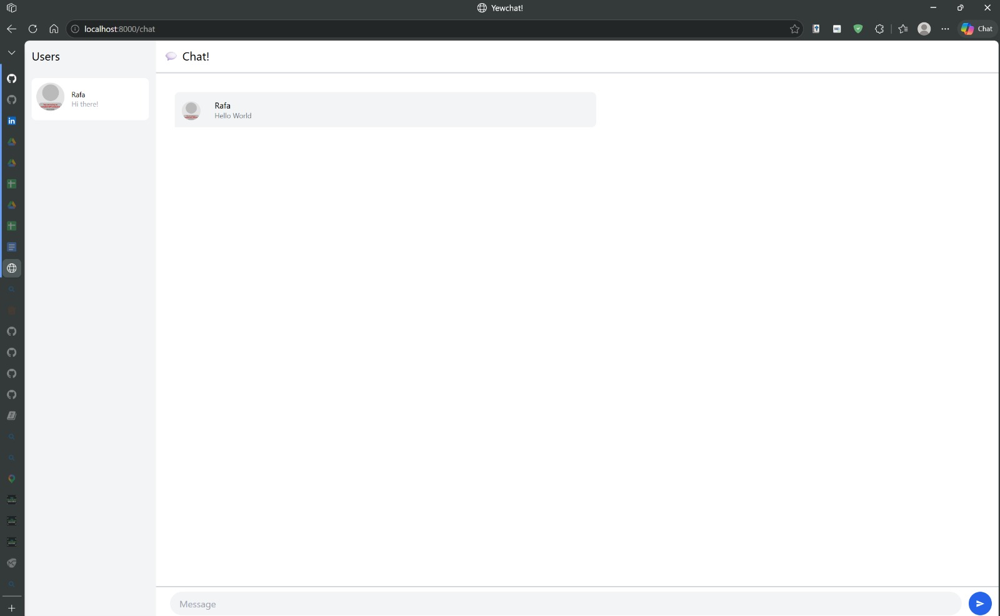
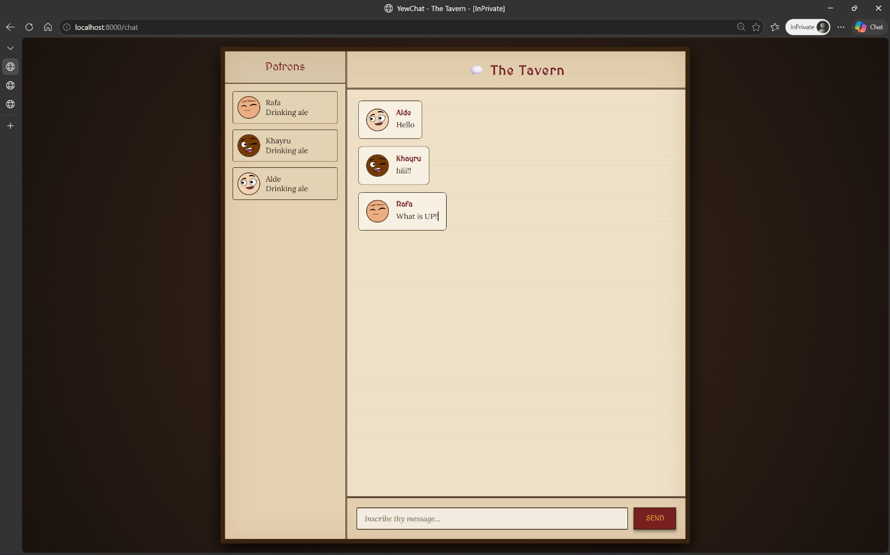

# YewChat 💬

> Source code for [Let’s Build a Websocket Chat Project With Rust and Yew 0.19 🦀](#)

## Install

1. Install the required toolchain dependencies:
   ```npm i```

2. Follow the YewChat post!

## Branches

This repository is divided to branches that correspond to the blog post sections:

* main - The starter code.
* routing - The code at the end of the Routing section.
* components-part1 - The code at the end of the Components-Phase 1 section.
* websockets - The code at the end of the Hello Websockets! section.
* components-part2 - The code at the end of the Components-Phase 2 section.
* websockets-part2 - The code at the end of the WebSockets-Phase 2 section.

# Module 10 - Yew WebChat

## Experiment 3.1: Original code



**Explanation:**
To run the original code, I cloned the NodeJS WebSocket server (`SimpleWebsocketServer`) and ran it in the background using `npm start` so it listens for incoming websocket connections. Then, I compiled and ran the Yew frontend using `npm start`, which uses Webpack and wasm-pack to build the Rust code into WebAssembly and serve it to the browser.

## Experiment 3.2: Be Creative!



**Explanation of Customization:**
To show the creative front-end styling and Rust component modification, I completely overhauled the application to feature a highly immersive "Medieval RPG Tavern" aesthetic. I started by modifying the Yew components (`chat.rs` and `login.rs`) to strip out the conflicting default Tailwind classes and replace them with clean, semantic class names.

I then heavily modified index.html with custom global CSS to create a tactile, parchment-and-wood layout. The design utilizes thematic typography ('MedievalSharp' for headings and 'Lora' for readable chat text), a warm candle-lit radial background, and heavy borders to simulate a physical tavern board. Furthermore, I fixed the broken DiceBear API endpoint that was failing to generate user avatars and wrote structural CSS flexbox rules to neatly align the chat messages and sidebar. I also added stylized custom Webkit scrollbars and interactive button states. This is just to make sure that the user interface delivers a cohesive, game-like experience while also maintaining the Rust logic cleanly separated from the presentation.